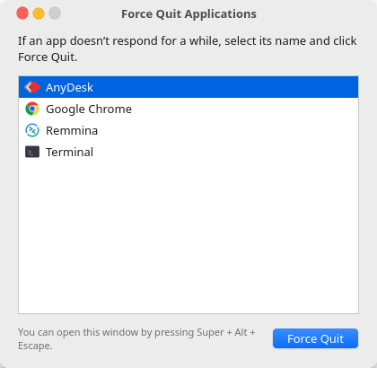
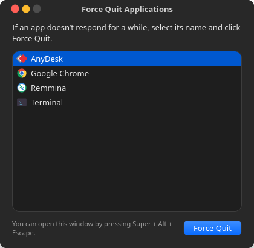

# Force Quit Applications for Linux

A clone of macOS's **Force Quit Applications** panel (⌘ ⌥ ⎋) for Linux.
Press **Super + Alt + Escape**, pick the frozen app, click **Force Quit**.

🌐 **Website & blog:** https://adgsenpai.github.io/AppleLinuxLikeForceQuit/

<p align="center">
  
  
</p>
<p align="center">
  
</p>

## Features

- Same layout and wording as macOS: traffic-light titlebar, app list with icons,
  "If an app doesn't respond for a while…" text, and a blue **Force Quit** button
- Confirmation alert: *Do you want to force “App” to quit? You will lose any unsaved changes.*
- Frozen apps are shown in red as **(Not Responding)**
- Multi-select with Ctrl/Shift-click to quit several apps at once
- **Files** stays at the bottom and gets **Relaunch** instead of Force Quit, like Finder
- List refreshes live, and pressing the shortcut again brings the open window to the front
- Follows the GNOME light/dark setting and keeps its macOS look on any GTK theme
- Works on Wayland and X11

Keys: `Return` force-quits the selection, `Esc` / `Ctrl+W` closes the window.

## Install

Needs Python 3 and GTK 4 bindings (already present on Ubuntu/Fedora GNOME):

```bash
sudo apt install python3-gi gir1.2-gtk-4.0   # if missing
git clone https://github.com/adgsenpai/AppleLinuxLikeForceQuit.git
cd AppleLinuxLikeForceQuit
./install.sh
```

This installs to `~/.local`, adds a "Force Quit Applications" launcher, and on GNOME
registers the **Super + Alt + Escape** custom shortcut. To use a different shortcut:

```bash
SHORTCUT='<Control><Super>Escape' ./install.sh
```

On other desktops (KDE, XFCE…), bind `~/.local/bin/force-quit` to a shortcut in
your keyboard settings.

Run without installing: `./bin/force-quit`. Remove with `./uninstall.sh`.

## How it works

Wayland doesn't let one program list another program's windows, so Force Quit looks
at processes instead:

1. GNOME starts each app in a systemd scope named after its desktop file
   (`app-gnome-org.gnome.Calculator-1234.scope`). `/proc/<pid>/cgroup` maps processes
   back to the app's name and icon.
2. D-Bus activated apps (like the terminal) and apps launched from a shell are
   matched by executable name, but only if they're connected to the display.
3. Only apps that show up in the app grid are listed, the same way macOS lists only Dock apps.
   Helper processes in separate scopes (Chrome) are grouped with their parent.

**Force Quit** sends `SIGKILL` to the app and all of its child processes, like macOS does.
An app is marked *Not Responding* when its process is stopped.

## License

MIT

---

Made with ❤️ by [ADGSTUDIOS](https://adgstudios.co.za)
